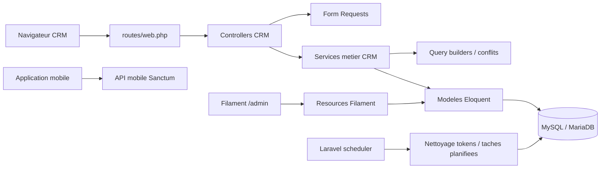
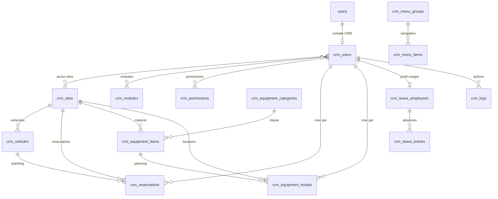
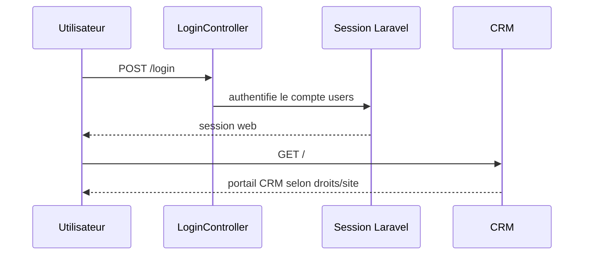
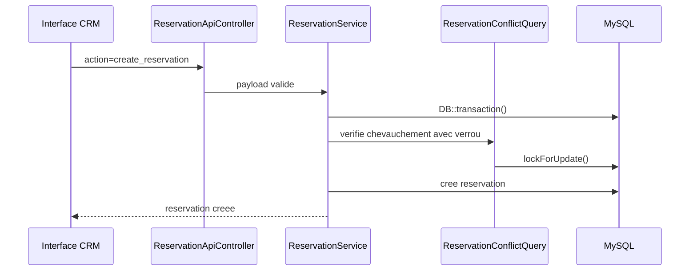
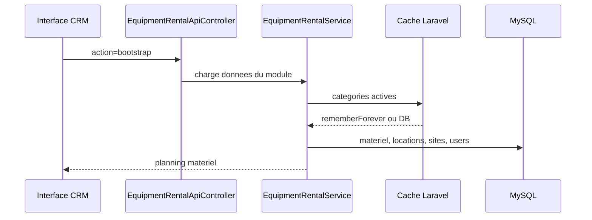
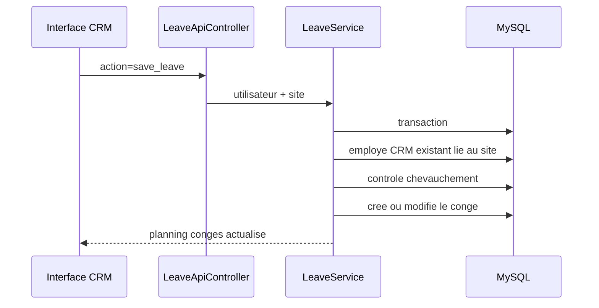

# Documentation technique CRM

Ce dossier regroupe la documentation technique du CRM Martin Sols : architecture,
schema de donnees, flux principaux, exploitation et deploiement.

## Architecture applicative



## Modules principaux

- Authentification web Laravel, avec comptes `users` et droits Spatie.
- Portail CRM React/Blade servi par les vues Laravel.
- Reservations vehicules avec controle de conflits.
- Locations de materiel avec categories, planning, demi-journee ou journee.
- Conges bases sur les utilisateurs CRM existants lies au site.
- Pages CRM administrables.
- Administration Filament pour les donnees de reference et permissions.
- API mobile via Sanctum.
- Endpoints legacy `.php` conserves pour compatibilite et audites par middleware.
- Creation admin par commande Artisan `crm:admin`, sans mot de passe stocke dans `.env.example`.

## Schema ER simplifie



## Tables metier

- `crm_sites` : sites disponibles dans le CRM.
- `crm_users` : profil CRM relie au compte Laravel `users`.
- `crm_modules`, `crm_permissions` : activation des modules et droits fins.
- `crm_user_sites`, `crm_user_modules`, `crm_user_permissions` : pivots de droits CRM.
- `crm_vehicles`, `crm_reservations` : flotte et planning vehicules.
- `crm_equipment_categories`, `crm_equipment_items`, `crm_equipment_rentals` : materiel et locations.
- `crm_leave_employees`, `crm_leave_entries` : profils conges et absences.
- `crm_menu_groups`, `crm_menu_items` : structure du menu.
- `crm_pages` : pages internes administrables.
- `crm_logs` : journal metier.
- `personal_access_tokens` : tokens Sanctum mobile.

## Flux principaux

### Connexion web



### Reservation vehicule



### Location materiel



### Conges



## Assets, logs et cache

- Les assets servis depuis `public/assets` sont appeles avec `App\Support\CrmAsset`.
- La version d'asset est calculee par `filemtime`, ou forcee par `CRM_ASSET_VERSION`.
- Les logs Laravel utilisent le canal `daily`, avec `LOG_DAILY_DAYS=30`.
- Le cache applicatif utilise le store configure par `CACHE_STORE`.
- Les categories materiel actives sont mises en cache et invalidees lors des modifications.

## Scheduler

Le scheduler Laravel doit etre execute toutes les minutes par cron :

```cron
* * * * * cd /home/jpfronpi/crm && php artisan schedule:run >> /dev/null 2>&1
```

Taches actuellement planifiees :

- `sanctum:prune-expired --hours=24`, chaque jour a `02:15`.

## Deploiement

Voir [DEPLOYMENT.md](DEPLOYMENT.md).

Commandes de controle apres deploiement :

```bash
php artisan migrate --force
php artisan optimize:clear
php artisan schedule:list
php artisan view:cache
php artisan view:clear
php artisan test
```

## Releases

Les releases doivent etre documentees dans `CHANGELOG.md` puis taguees dans Git.

Convention recommandee :

```bash
git tag -a vYYYY.MM.DD.N -m "Release vYYYY.MM.DD.N"
git push origin vYYYY.MM.DD.N
```

Ne pas creer de tag tant que les modifications de la release ne sont pas commitees.
