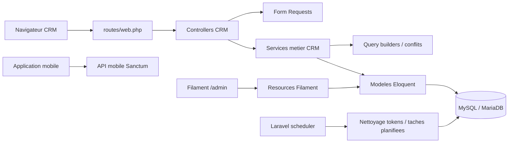
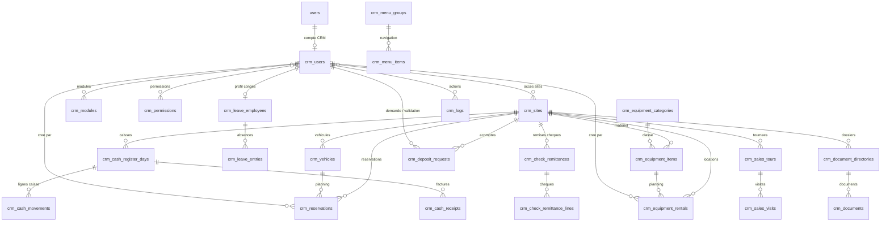
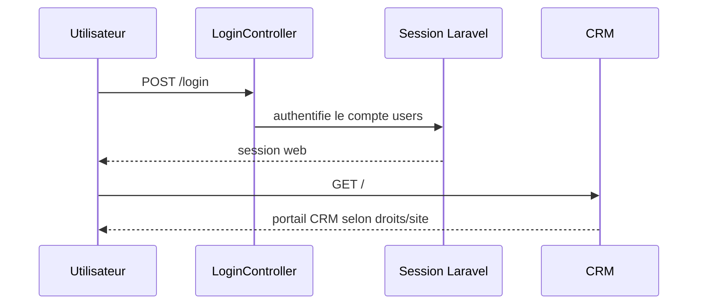
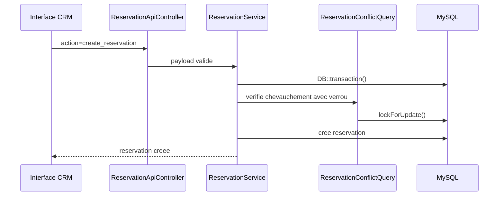
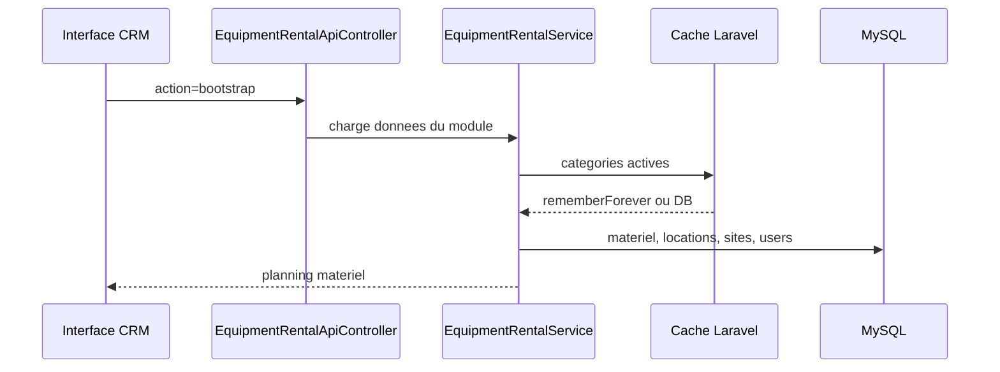
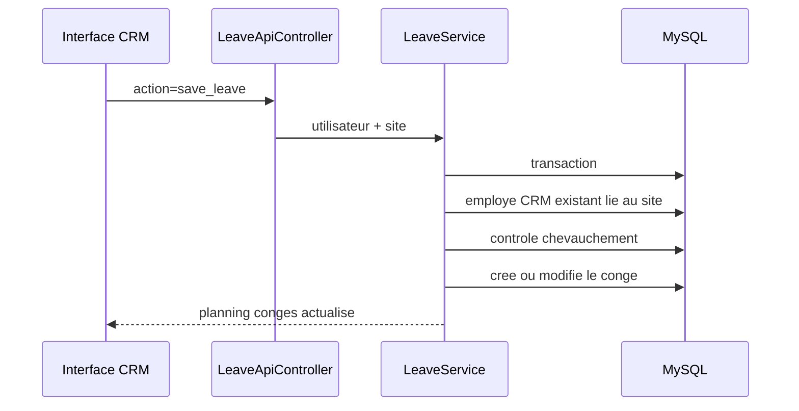
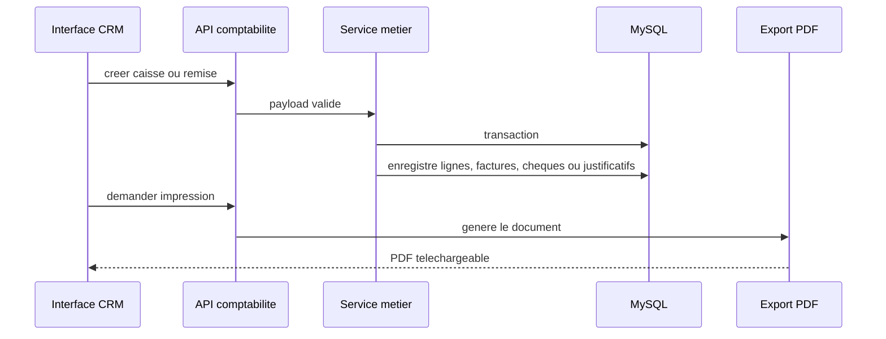
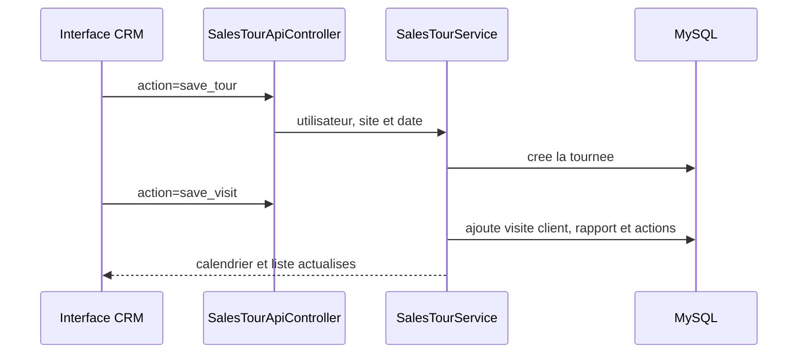

# Documentation technique CRM

Ce dossier regroupe la documentation technique du CRM Martin Sols : architecture,
schema de donnees, flux principaux, exploitation et deploiement.

## Architecture applicative



## Modules principaux

- Authentification web Laravel, avec comptes `users` et droits Spatie.
- Portail CRM React/Blade servi par les vues Laravel.
- Reservations vehicules avec controle de conflits.
- Locations de materiel avec categories, planning, demi-journee ou journee.
- Conges bases sur les utilisateurs CRM existants lies au site.
- Rapport de visite pour tournees commerciales, visites clients, comptes rendus et suivi des actions.
- Controle caisse avec encaissements, sorties, comptage especes, ecarts, justificatifs et PDF.
- Demandes d'acompte avec creation terrain et validation comptable.
- Remises de cheques avec photos, aide OCR, controles signature/destinataire et export PDF.
- Documents par site : Promo, Fiches techniques et Procedures.
- Tapis ROMUS integre pour saisir les mesures et generer les PDF.
- Pages CRM administrables.
- Administration Filament pour les donnees de reference et permissions.
- PWA installable via `manifest.json` et Service Worker.
- API mobile via Sanctum.
- Endpoints legacy `.php` conserves pour compatibilite et audites par middleware.
- Creation admin par commande Artisan `crm:admin`, sans mot de passe stocke dans `.env.example`.

## Experience developpeur

- Standard modulaire : [CRM_MODULE_STANDARD.md](CRM_MODULE_STANDARD.md)
- Guide de creation d'un module : [MODULE_CREATION_GUIDE.md](MODULE_CREATION_GUIDE.md)
- Deploiement : [DEPLOYMENT.md](DEPLOYMENT.md)
- Migration des endpoints legacy : [LEGACY_API_MIGRATION.md](LEGACY_API_MIGRATION.md)

Commandes utiles :

```bash
make install
make hooks
make quality
make deploy-check
```

`make hooks` active `.githooks/pre-commit`, qui verifie Laravel Pint sur les fichiers PHP stages avant chaque commit.

## Schema ER simplifie



## Tables metier

- `crm_sites` : sites disponibles dans le CRM.
- `crm_users` : profil CRM relie au compte Laravel `users`.
- `crm_modules`, `crm_permissions` : activation des modules et droits fins.
- `crm_user_sites`, `crm_user_modules`, `crm_user_permissions` : pivots de droits CRM.
- `crm_vehicles`, `crm_reservations` : flotte et planning vehicules.
- `crm_equipment_categories`, `crm_equipment_items`, `crm_equipment_rentals` : materiel et locations.
- `crm_leave_employees`, `crm_leave_entries` : profils conges et absences.
- `crm_cash_register_days`, `crm_cash_movements`, `crm_cash_receipts` : controle caisse, lignes, factures et comptage.
- `crm_cash_receipt_archives`, `notification_logs` : archivage comptable et suivi des notifications.
- `crm_check_remittances`, `crm_check_remittance_lines` : remises de cheques, photos et montants.
- `crm_deposit_requests` : demandes d'acompte et validation.
- `crm_sales_tours`, `crm_sales_visits` : rapports de visite commerciaux et visites clients.
- `crm_document_directories`, `crm_documents` : bibliotheque documentaire par categorie et site.
- `crm_menu_groups`, `crm_menu_items` : structure du menu.
- `crm_pages` : pages internes administrables.
- `crm_logs` : journal metier des actions critiques, alimente par `CrmActivityLogger`.
- `personal_access_tokens` : tokens Sanctum mobile.

## Flux principaux

### Connexion web



### Reservation vehicule



### Location materiel



### Conges



### Controle caisse et remises de cheques



### Rapport de visite



## Assets, logs et cache

- Les assets servis depuis `public/assets` sont appeles avec `App\Support\CrmAsset`.
- Les assets de modules sont publies vers `public/modules` avec `php artisan crm:publish-module-assets --force`.
- La version d'asset est forcee par `CRM_ASSET_VERSION`, puis par `.deployed-revision` en deploiement, puis par `filemtime`.
- Les logs Laravel utilisent le canal `daily`, avec `LOG_DAILY_DAYS=30`.
- Le canal `horizon` est configure en `daily` sur `storage/logs/horizon.log`.
- Le cache applicatif utilise le store configure par `CACHE_STORE`.
- Les categories materiel actives sont mises en cache et invalidees lors des modifications.
- Les routes API CRM utilisent `CRM_API_THROTTLE_PER_MINUTE`; login web et token mobile utilisent `CRM_LOGIN_THROTTLE_PER_MINUTE`.
- Les reponses JSON API peuvent etre compressees en gzip via `CRM_RESPONSE_COMPRESSION_ENABLED`.
- Les sauvegardes SQL locales sont ecrites par `backup:run` dans `CRM_BACKUP_PATH` sur `CRM_BACKUP_DISK`.
- Le developpement local peut utiliser Sail via `docker-compose.yml`.
- La CI GitHub lance Pint, le build Vite et les tests sur PHP 8.3.

## Scheduler

Le scheduler Laravel doit etre execute toutes les minutes par cron :

```cron
* * * * * cd /home/jpfronpi/crm/current && php artisan schedule:run >> /dev/null 2>&1
```

Taches actuellement planifiees :

- `sanctum:prune-expired --hours=24`, chaque jour a `02:15`.
- `backup:run --quiet`, chaque jour a `02:30`.

Les sauvegardes locales par defaut sont conservees dans `storage/app/private/backups/database`.
Pour un stockage externe, configurer un disque S3 puis passer `CRM_BACKUP_DISK=s3` et un chemin dedie.

## Deploiement

Voir [DEPLOYMENT.md](DEPLOYMENT.md).

Commandes de controle apres deploiement :

```bash
php artisan migrate --force
php artisan optimize:clear
php artisan schedule:list
php artisan view:cache
php artisan view:clear
php artisan test
```

Quand le nombre de migrations deviendra trop couteux pour les environnements de test, generer un schema dump avec `php artisan schema:dump` depuis une base propre et versionner le fichier genere.

Les migrations CRM sont versionnees dans `Modules/*/database/migrations`; seules les migrations globales Laravel et les migrations de packages restent dans `database/migrations`.

## Releases

Les releases doivent etre documentees dans `CHANGELOG.md` puis taguees dans Git.

Convention recommandee :

```bash
git tag -a vYYYY.MM.DD.N -m "Release vYYYY.MM.DD.N"
git push origin vYYYY.MM.DD.N
```

Ne pas creer de tag tant que les modifications de la release ne sont pas commitees.
